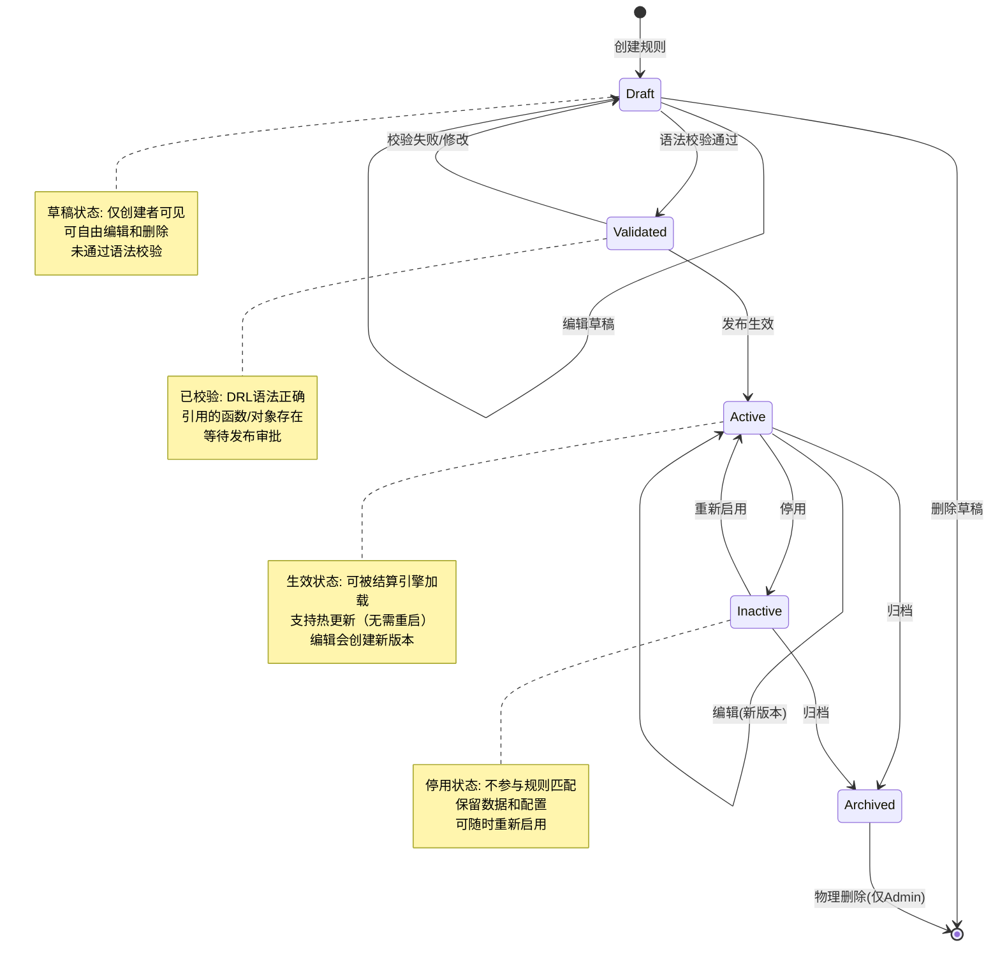
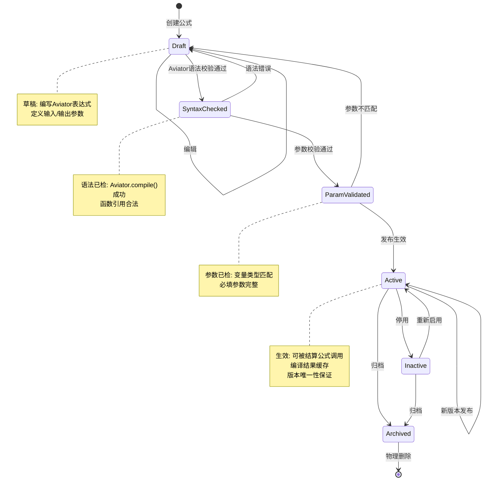
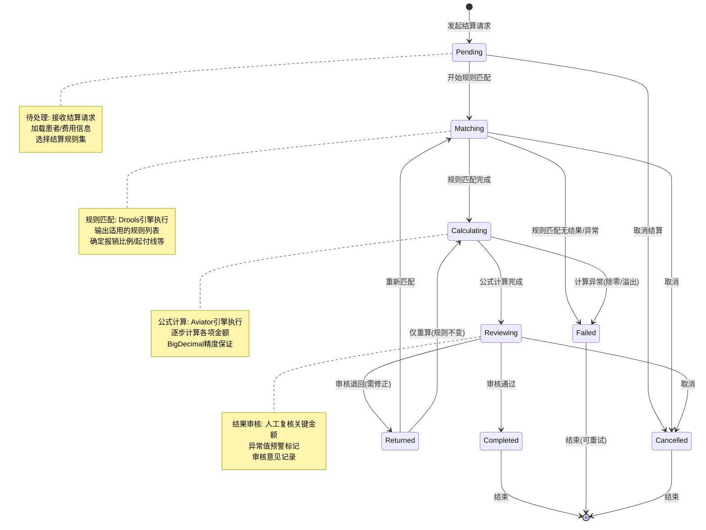
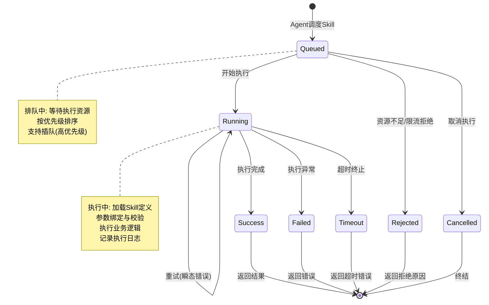
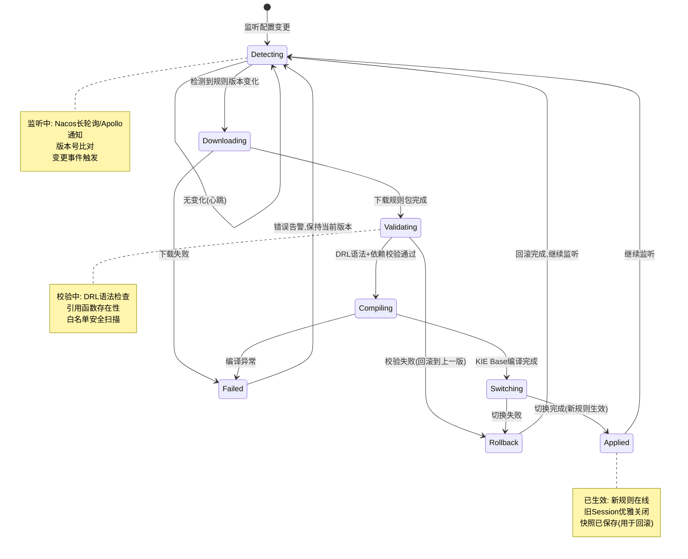
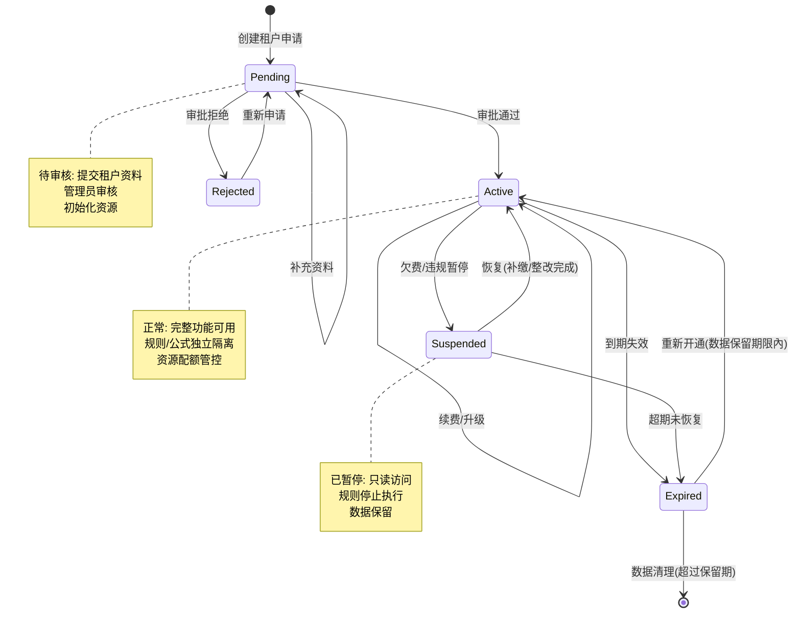
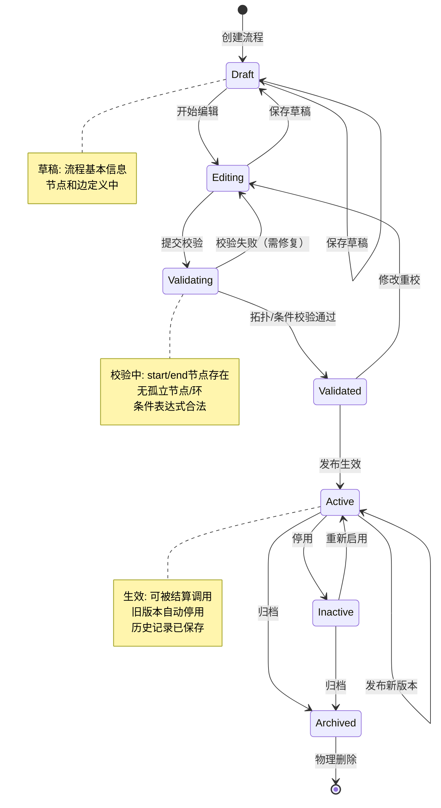

# 状态机 - HIS 动态规则中台

> 核心实体的状态流转定义，使用 Mermaid 图表示

---

## SM-01: 规则定义状态机

**状态枚举**: `RuleDefinition.Status` = `draft` | `validated` | `active` | `inactive` | `archived`

**关键约束**:
- Draft → Validated 需要 DRL 语法检查 + 依赖校验
- Validated → Active 需要审批流程（如项目开启了规则审核）
- Active → 编辑会创建新版本，旧版本自动归档
- Active 规则可通过 Nacos/Apollo 热更新

---

## SM-02: 公式定义状态机

**状态字段**: `Formula.Status` = `draft` | `syntax_checked` | `param_validated` | `active` | `inactive` | `archived`

**关键约束**:
- Draft → SyntaxChecked 通过 AviatorEvaluator.compile() 验证
- SyntaxChecked → ParamValidated 校验所有引用变量是否在 param_defs 中注册
- Active → 新版本发布时，旧版本自动设为 inactive（同一 key 只有一个 active）

---

## SM-03: 结算记录状态机

**状态字段**: `SettlementRecord.status` = `pending` | `matching` | `calculating` | `reviewing` | `completed` | `returned` | `failed` | `cancelled`

**关键约束**:
- Pending → Matching 时锁定就诊信息（防止并发修改）
- Matching → Calculating 要求至少匹配到一条有效规则
- Calculating → Reviewing 时进行合理性校验（金额范围/比例检查）
- Reviewing → Completed 需要审核人确认签名
- Failed 状态支持重试（有限次，默认 3 次）

---

## SM-04: Skill 执行状态机

**状态字段**: `SkillExecution.status` = `queued` | `running` | `success` | `failed` | `timeout` | `rejected` | `cancelled`

**关键约束**:
- Queued → Running 受限于并发数限制（默认 10）
- Running → Timeout 默认 30s，可在 skill 定义中自定义
- Failed 支持自动重试（可配置重试策略：固定间隔/指数退避）
- 所有终态都会写入 skill_execution_log 表

---

## SM-05: 规则热更新状态机

**状态字段**: `RuleHotUpdate.status` = `detecting` | `downloading` | `validating` | `compiling` | `switching` | `applied` | `rollback` | `failed`

**关键约束**:
- Validating 失败自动触发 Rollback，不会导致服务不可用
- Switching 采用双缓冲策略：新 Session 就绪后才切换，实现零停机
- Rollback 时从 rule_snapshot 表恢复上一版本的 DRL 文本
- Applied 后发送 webhook 通知（可选）给监控系统

---

## SM-06: 租户状态机

**状态字段**: `Tenant.Status` = `pending` | `active` | `suspended` | `expired` | `rejected`

**关键约束**:
- Pending → Active 时自动初始化租户资源（数据库 schema / 缓存命名空间）
- Suspended 状态下已有结算任务执行完毕后停止接受新任务
- Expired 超过 90 天（可配置）后触发数据清理

---

## SM-07: 规则编排流程（RuleFlow）状态机

**状态字段**: `RuleFlow.status` = `draft` | `editing` | `validating` | `validated` | `active` | `inactive` | `archived`

**关键约束**:
- Draft → Validating 必须包含至少 1 个 start 节点和 1 个 end 节点
- Validating → Validated 校验拓扑完整性（无孤岛/无死循环）+ Aviator 条件表达式编译成功
- Active → 新版本发布时，旧版本自动 inactive（同一流程同租户只一个 active）
- Archived 流程不可恢复，只能作为新流程模板复制

---

最后更新: 2026-05-10 | 共 7 个核心状态机
